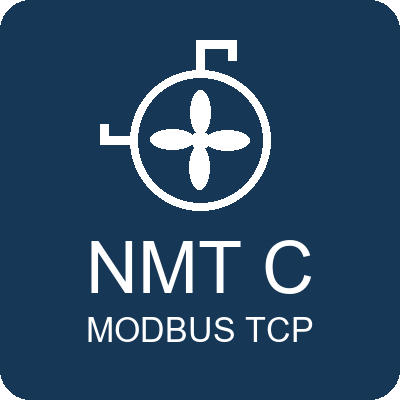
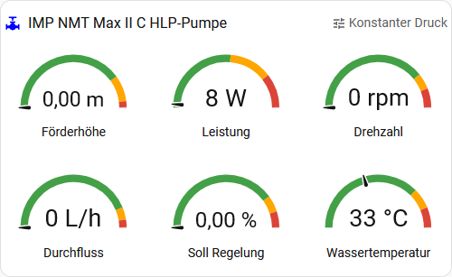

### IMP NMT C Serie
**Home Assistant Modbus TCP**

<br clear="left"/>

**YAML-Package zur Integration von IMP Pumps NMT C Heizkreislaufpumpen in Home Assistant via Modbus TCP (NMTC-Modul).**

<a href="README.md">English version</a>

---

## Kompatible Pumpen

Dieses Package funktioniert mit allen IMP-Pumpen-Modellen, die mit dem **NMTC-Modul** (Art.-Nr. 7340055) ausgestattet sind:

- NMT Smart C
- NMT Max C
- NMT Lan C
- NMT Max II C
- NMT Smart II C

Das NMTC-Modul stellt die Modbus TCP/RTU-Schnittstelle bereit. Die Modbus-Register-Map ist bei allen genannten Modellen identisch.

## Features

- **10 Sensoren**: Förderhöhe, Durchfluss, Drehzahl, Stromverbrauch, Frequenz, Effizienz, Sollwert, drei Temperaturen (Elektronik, Motor, Wasser)
- **Status-Bits**: 4 Binärsensoren aus dem Statusregister (Pumpe rotiert, Fernsteuerung, Fehler, Störung aktiv)
- **Betriebsmodus**: Zwei Textsensoren mit Klartextanzeige des aktuellen Betriebsmodus (Standard- + alternative Enumeration)
- **Fehlercodes**: 3 Fehlercode-Sensoren mit lesbaren Textbeschreibungen (20 bekannte Codes aus dem NMTC-Handbuch)
- **Berechnete Werte**: Durchfluss in L/h (umgerechnet aus nativem m³/h), Fehlercode-Zusammenfassung
- **Dashboard-Karte**: Fertige Lovelace-Karte mit 6 Gauge-Anzeigen

## Entity-Qualität

Alle Sensoren sind mit korrekten und vollständigen HA-Metadaten definiert: `unique_id`, `device_class`, `state_class`, `unit_of_measurement`, `scale`, `precision` und `input_type` sind für jede Entity bestmöglich gesetzt. Dadurch funktionieren Langzeitstatistiken, Energiedashboard-Integration und History-Graphen sofort und ohne manuelle Nacharbeit. Alle Template-Sensoren enthalten `availability`-Templates, um bei Verbindungsverlust korrekt `unavailable` anzuzeigen statt irreführender Standardwerte.

## Voraussetzungen

- Home Assistant (aktuelle Version)
- IMP Pumps Heizkreislaufpumpe mit **NMTC-Modul** (siehe kompatible Pumpen oben)
- Netzwerkverbindung zwischen HA und NMTC-Modul (Ethernet)
- Standard-Modbus-Slave-Adresse: **245**

## Installation

1. `imp_nmt_c.de.yaml` nach `/config/packages/` kopieren
2. Packages in `configuration.yaml` aktivieren:
   ```yaml
   homeassistant:
     packages: !include_dir_named packages
   ```
3. IP-Adresse des NMTC-Moduls anpassen (Zeile 9 in der YAML):
   ```yaml
   host: 192.168.2.17  # ← ÄNDERN: IP des NMTC-Moduls
   ```
4. Home Assistant neu starten

> **Englische Version:** Alle Entity-Namen, Template-Texte und Kommentare auf Englisch: `imp_nmt_c.yaml` und `dashboard_card.yaml`.

## Dashboard-Karte (optional)

<p align="center">
  
</p>

Die Datei `dashboard_card.de.yaml` enthält eine fertige Lovelace-Karte mit Gauge-Anzeigen für Förderhöhe, Leistung, Drehzahl, Durchfluss, Sollwert und Wassertemperatur.

**Nutzung:** Den Inhalt von `dashboard_card.de.yaml` als manuelle Karte (YAML) im Dashboard-Editor einfügen.

### Benötigte HACS-Karten

| HACS-Karte | Zweck | HACS-Suche |
|---|---|---|
| [**Vertical Stack In Card**](https://github.com/ofekashery/vertical-stack-in-card) | Äußerer Container ohne Rahmen | `vertical-stack-in-card` |
| [**card-mod**](https://github.com/thomasloven/lovelace-card-mod) | CSS-Styling (Rahmen entfernen, Farben) | `card-mod` |

Ohne diese Karten wird die Dashboard-Karte nicht korrekt dargestellt. Die Modbus-YAML selbst funktioniert unabhängig davon.

## Register-Übersicht

### Messwerte (nur lesen, Register-Block 301)

| Register | Sensor | Einheit |
|---|---|---|
| 301 | Förderhöhe | m |
| 302 | Durchfluss | m³/h |
| 303 | Effizienz | % |
| 304 | Drehzahl | rpm |
| 305 | Frequenz | Hz |
| 308 | Aktueller Sollwert | % |
| 312/313 | Leistung (HI/LO) | W |
| 318 | Elektroniktemperatur | °C |
| 319 | Motortemperatur | °C |
| 322 | Wassertemperatur | °C |

### Status-Register (nur lesen, Register-Block 201)

| Register | Sensor | Beschreibung |
|---|---|---|
| 201 | StatusReg | Bitfeld (Rotation, Fernsteuerung, Fehler, nahe Max/Min-Drehzahl) |
| 203 | ControlMode (Alt) | Alternative Betriebsmodus-Enumeration |
| 205-207 | ErrorCode 1-3 | Fehlercodes (0 = kein Fehler) |
| 208 | ControlMode | Aktueller Betriebsmodus (0..3) |

### Optionale Register (nicht auf allen Modellen verfügbar)

| Register | Sensor | Einheit |
|---|---|---|
| 327/328 | Betriebszeit | h |
| 329/330 | Einschaltzeit Modul | h |
| 332/333 | Energieverbrauch Gesamt | kWh |

### Steuerregister (Lesen/Schreiben) — nicht implementiert

Register 101 (ControlReg), 104 (SetPoint) und 108 (ControlMode) existieren, sind aber bewusst nicht implementiert. Details in den YAML-Kommentaren.

## Entity-Referenz

Siehe [entities.de.md](entities.de.md) für eine vollständige Zuordnung von Registern zu Entity-Namen, oder [entities.en.md](entities.en.md) für die englische Version.

## Dokumentation

- [NMTC-Modul-Handbuch v37 (PDF)](https://imp-pumps.com/wp-content/uploads/2020/03/NMTC_manual_v37.pdf) — offizielle IMP-Pumps-Dokumentation inkl. Modbus-Registerdefinitionen (Kapitel 8)

## Lizenz

[MIT](LICENSE)
